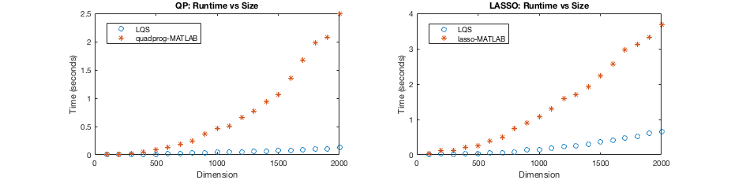

## Description

This software package solves the [lasso](https://en.wikipedia.org/wiki/Lasso_(statistics)) or [basis pursuit denoising](https://en.wikipedia.org/wiki/Basis_pursuit_denoising) problem

`min ||Ax - b|| + lambda*|x|` 

and the box-constrained [quadratic program](https://en.wikipedia.org/wiki/Quadratic_programming) 

`min 1/2*x'*Q*x + b'*x subject to l <= x <= u`.

The main function `LassoQuadraticSolver` is based on a smoothing method which was presented in two recent papers

* [Forward–backward quasi-Newton methods for nonsmooth optimization problems](https://link.springer.com/article/10.1007/s10589-017-9912-y) and 

* [Augmented Lagrangians, box constrained QP and extensions](https://academic.oup.com/imajna/article/37/4/1635/3059683)

In my [qualifying exam proposal](https://github.com/Will-Wright/lasso-quadratic-solver/blob/master/will_wright_qualifying_exam_proposal.pdf) I prove that the two methods developed above are equal (note that the lasso problem must be in the Lagrangian form for this equivalence, see page 8-9 of the proposal).

**Note that the solver `LassoQuadraticSolver` is a prototype and may require additional parameter tuning for general use or ill-conditioned lasso/quadratic programs.**

### New Contributions:

* Proof of equivalence of the two methods listed above

* Implementation of `LassoQuadraticSolver` method in MATLAB

* Numerical results demonstrating that `LassoQuadraticSolver` is **faster** and **more accurate** than the MATLAB built-in software [lasso](https://www.mathworks.com/help/stats/lasso.html) and [quadprog](https://www.mathworks.com/help/optim/ug/quadprog.html) for a range of randomly generated problems.

## Demo Tutorial

The following results may be reproduced by running the function `RunDemo`.  Note that the LASSO and quadratic programming experiments are entirely separate.  The results below are back-to-back for comparison purposes.

First, we see that runtime for `LassoQuadraticSolver` increases approximately linearly with dimension `n`, while runtime for the MATLAB functions `quadprog` and `lasso` increases exponentially.  This difference is a result of `quadprog` and `lasso` relying on interior-point methods, thus requiring matrix factorization which scales at `O(n^3)`.  The main computational cost in `LassoQuadraticSolver` is a sparse matrix-vector product which scales much better.

Next, we see that runtime for `LassoQuadraticSolver` is consistently less than `quadprog` and `lasso`, regardless of the sparsity level of the underlying problem.

Finally, we see that `LassoQuadraticSolver` is more accurate than `lasso` and `quadprog` for this set of problems.  This difference in accuracy is again a result of `lasso` and `quadprog` relying on interior-point methods which are limited to square-root machine precision.  In contrast, `LassoQuadraticSolver` can attain machine-precision accuracy because this method operates somewhat like an active set method (e.g., the simplex method) which can precisely locate the exact
solution once the correct active set is found.

